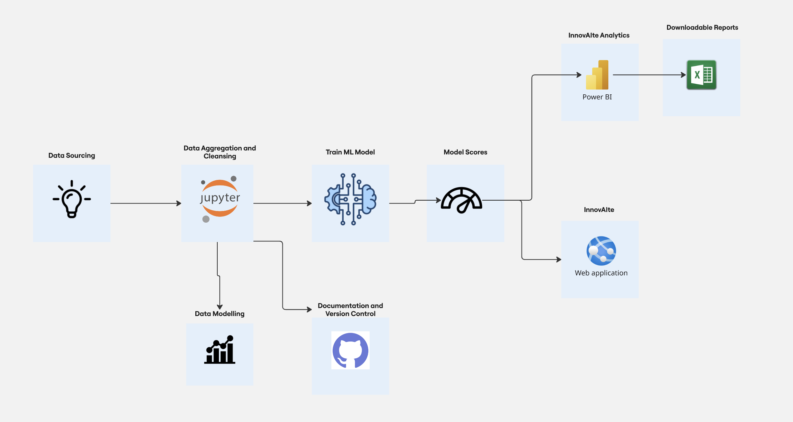

# InnovAIte: Idea Portal AI Agent with React Framework  
**[View the Tool!](https://fourtokens.onrender.com)**

## 📌 Project Overview  
**InnovAIte** is an advanced platform designed to streamline the process of innovation by empowering users to submit ideas and have them prioritized using artificial intelligence. The platform utilizes an **AI agent powered by the ReAct (Reasoning-Action) framework** to evaluate ideas based on **Business Impact**, **Return on Investment (ROI)**, and **Strategic Alignment**.  

With a user-friendly frontend and a powerful backend, InnovAIte helps businesses **maximize the value of customer-driven innovation** while offering clear insights and tracking the development process through a **PowerBI Analytics Dashboard**.

## 🎯 Objective  
InnovAIte is designed to **facilitate crowdsourced innovation**, allowing businesses to **collect, assess, and prioritize customer ideas**. By leveraging AI, the platform identifies the most impactful ideas based on multiple business metrics, ensuring the development team can focus on **high-priority projects** that offer substantial ROI and align with strategic goals.

## ✨ Key Features

- **🧠 AI Agent with ReAct Framework**  
  Powered by the **ReAct (Reasoning + Action)** framework, the AI agent evaluates ideas, identifies high-value concepts, and recommends the **top 3 ideas** for prioritization using machine learning models.

- **📊 Model Scores for Prioritization**  
  Each idea is **scored and ranked** based on three key business metrics:
  - **Business Impact**
  - **Return on Investment (ROI)**
  - **Strategic Alignment**  
  These scores offer transparency and help users understand the **rationale behind prioritization**.

- **💡 Detailed Idea Interface with Thought Chains**  
  The platform presents prioritized ideas along with the **chain of reasoning** used by the AI agent. This provides clarity and supports informed decision-making by the development team.

- **📈 InnovAIte Analytics Dashboard**  
  A comprehensive **PowerBI dashboard** that tracks the **real-world performance** of implemented ideas. Users can analyze the impact on various business metrics and decide **which metric to optimize next**.


## Repo Structure
- agents/ - python script for the AI ReAct Agent.
- data/ - filtered datasets relevant to the ideas on the portal and model scores.
- notebooks/ - Jupyter Notebooks which were used to generate the datasets and do experiments.
- templates/ - contains all the html files for the webpage.
- Additional files include .gitignore, ai_agent_prompting, app.py, chain_of_thought.py, data_maps, priority_agent.py and requriements.txt


## Technologies Used

- Backend: Python, Flask
- Frontend: JavaScript, HTML/CSS, jQuery
- Data Storage: CSV Files
- Visualization: PowerBI, Matplotlib
- Data Processing: Pandas, NumPy, Scikit-Learn, LangChain

## Installation

To run this project locally, follow these steps:

1. Clone the Repository:
```bash
git clone https://github.com/suhaasbadada/4tokens.git
```

2. Install Dependencies:
```bash
pip install -r requirements.txt
```

3. Set Up the Database:
   Ensure your database is set up with the appropriate schema and import the necessary datasets.

4. Run the Web Application:
```bash
python app.py
```
   Visit http://localhost:5000 in your web browser to access the platform.

## Usage

- **Explore Ideas**: Navigate to the "Priority" tab to view the top 3 ideas recommended by the AI agent.
- **View Prioritized Ideas**: Navigate to the "Priority" tab to view the top 3 ideas recommended by the AI agent.
- **Customize Prioritization**: Adjust the weights of Business Impact, ROI, and Strategic Alignment to see how the prioritized ideas change based on your inputs.
- **Review Analytics**: Explore the PowerBI analytics dashboard to track how the prioritized ideas have impacted the business over time and adjust strategies accordingly.


## Datasets
### Ideas Dataset
This dataset captures all ideas submitted through the platform. Each entry contains the following information:

The dataset consists of structured information about ideas submitted by users. It is organized into high-level categories capturing metadata, business impact, financial viability, and strategic relevance.

### 📌 Idea Details
- `ID`: Unique identifier for the idea  
- `Description`: Textual summary of the idea  
- `Upvotes`: Number of user endorsements  
- `Comments`: Number of user comments  
- `Submission Date`: Date the idea was submitted  
- `Status`: Current status of the idea (e.g., proposed, in progress, implemented)

### 📊 Business Impact
- `est_dev_time_days`: Estimated development time (in days)  
- `complexity_score`: Complexity of implementation  
- `num_teams_required`: Number of teams needed for development  
- `resource_cost_usd`: Estimated resource cost in USD  
- `infra_dependencies_count`: Number of infrastructure dependencies  
- `tech_risk_score`: Technical risk associated with implementation  
- `design_effort_days`: Estimated design effort in days  
- `qa_effort_days`: Estimated quality assurance effort in days  
- `deployment_complexity`: Complexity of deploying the solution  
- `integration_needed`: Indicates if integration with other systems is required

### 💰 Return on Investment (ROI)
- `business_impact_score`: Estimated impact on business  
- `user_demand_score`: Score based on user demand  
- `customer_satisfaction_impact`: Impact on customer satisfaction  
- `time_saved_per_user_minutes`: Minutes saved per user per use  
- `num_users_impacted`: Number of users affected by the feature  
- `market_differentiation_score`: Score reflecting uniqueness in the market  
- `revenue_potential_usd`: Estimated revenue potential  
- `cost_savings_usd`: Estimated cost savings  
- `scalability_potential_score`: Score estimating how scalable the idea is  
- `feature_adoption_likelihood`: Likelihood of user adoption of the feature

### 🧭 Strategic Alignment
- `aligns_with_okrs`: Indicates if the idea aligns with key OKRs  
- `supports_key_initiative`: Whether it supports a strategic initiative  
- `compliance_or_regulatory_benefit`: Benefit in terms of compliance or regulation  
- `innovation_score`: Score indicating the level of innovation  
- `executive_priority_flag`: Flag showing executive interest or sponsorship  
- `strategic_timeline_alignment`: Whether it fits the company’s strategic timeline  
- `mission_critical_flag`: Indicates if it’s mission-critical  
- `long_term_value_score`: Score assessing long-term business value


### Solution Architecture
This architecture illustrates the data flow from the idea portal, through the stages of aggregation, cleansing, and machine learning processing. The prioritized ideas are then displayed on the InnovAIte portal and the decision making analytics are visualized on the PowerBI dashboard.




## Contributors

- Aishwarya Deoraj
- Suhaas Rao Badada
- Abhay Singh
- Shubham Kumar
